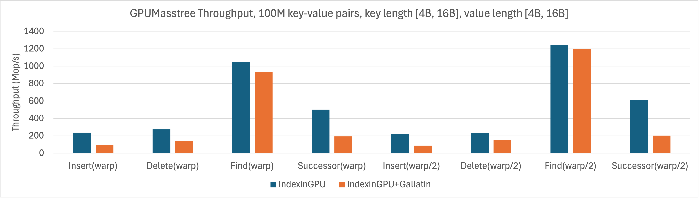
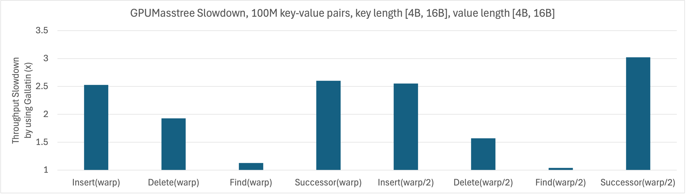
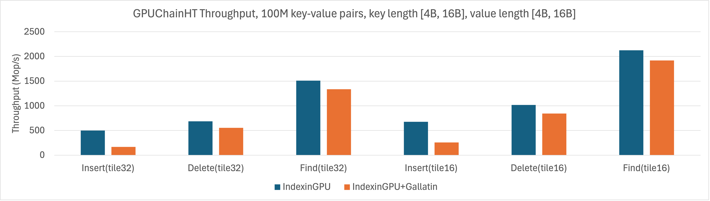
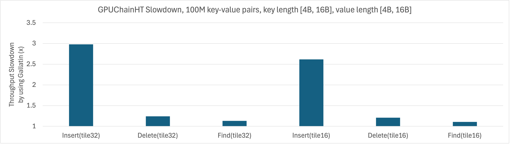
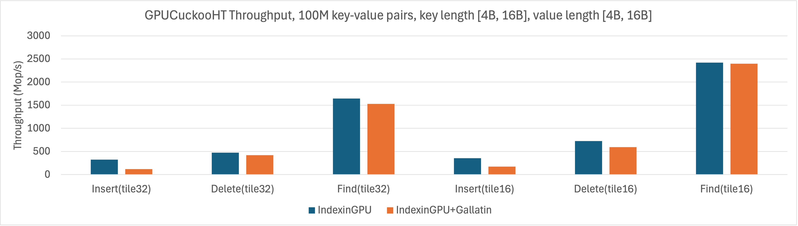
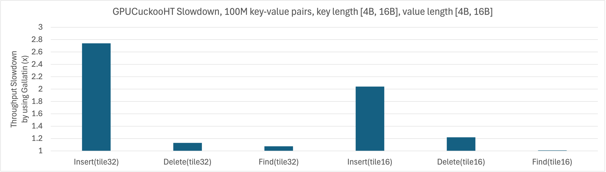
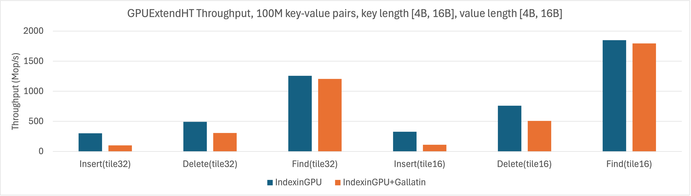
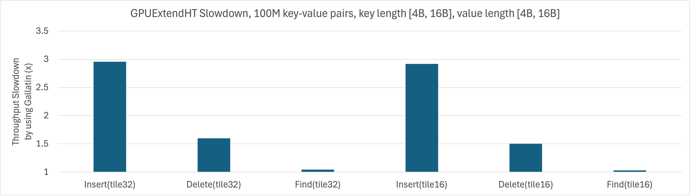

# IndexinGPU + Gallatin Test

This branch contains IndexinGPU + [Gallatin](https://github.com/saltsystemslab/gallatin.git) integration and performance comparison.
For basic information of IndexinGPU, see [README.basic.md](README.basic.md).

Since Gallatin uses 64-bit pointer but IndexinGPU stores 32-bit memory block identifier, we manually convert the former into 32-bit identifier for each 128B memory block allocated.
We also set Gallatin's minimum block size to 128B.

## Run performance tests by:

```shell
# Clone `baselines/gallatin`
git submodule update --init
# Build
mkdir build
cd build
cmake -DCMAKE_BUILD_TYPE=Release ..
make -j
# Run tests; example 100M key-value pairs, each length in 4B-16B
./bin/masstree_bench num-keys=100000000 min-key-length=1 max-key-length=4 min-key-length=1 max-key-length=4 num-experiments=10
./bin/fixedhashtable_bench num-keys=100000000 min-key-length=1 max-key-length=4 min-key-length=1 max-key-length=4 num-experiments=10
./bin/extendhashtable_bench num-keys=100000000 min-key-length=1 max-key-length=4 min-key-length=1 max-key-length=4 num-experiments=10
```

## Measurement results in Azure NC24ads A100 v4 VM:

By using `gallatin_allocator`, compared to our `simple_slab_allocator`, we observe average 2.7x slowdown on insert throughputs and 1.4x slowdown on delete throughputs.
GPUChainHT at full-warp tiles showed up to 3.0x slowdown.
Note that read operations (find, successor) do not allocate/deallocate memory blocks, so the throughputs have no big impact.

### GPUMasstree





### GPUChainHT





### GPUCuckooHT





### GPUExtendHT






